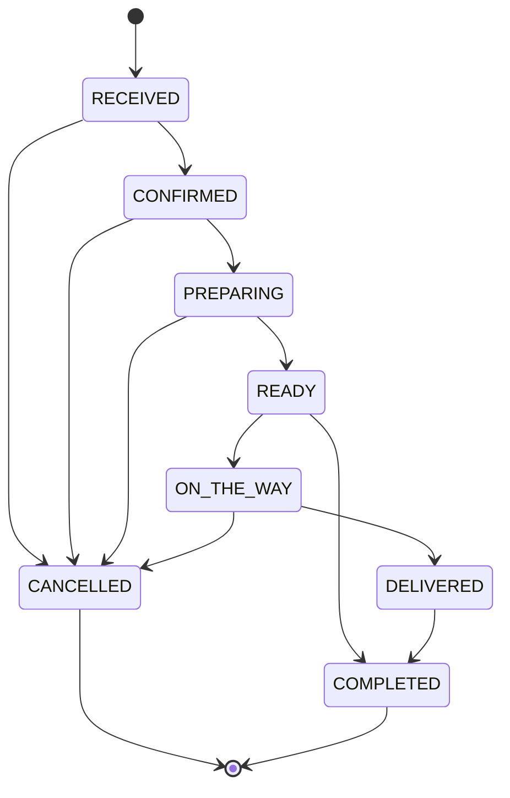

# SushiMei Platform Blueprint (Fiber + PostgreSQL)

## 1) Full System Architecture

### Architecture Style
- Frontend web apps: Customer App, Admin Panel, Spot Staff Panel (Next.js/React)
- API layer: Go Fiber service (`/api/v1`)
- Data layer: PostgreSQL 16 (OLTP), Redis (cache/session/OTP), object storage (images)
- Async layer: background jobs for notifications/reports (worker process)
- Realtime layer: WebSocket/SSE for order status and spot queue updates

### Logical Components
- API Gateway/Ingress: TLS termination, rate-limit, WAF
- Auth module: OTP login (customer), password login (employees), JWT + refresh rotation
- RBAC module: role-permission checks per endpoint
- Order module: lifecycle, timeline, status transitions, refunds/cancellations
- Menu module: nested categories, products, variants, modifiers, availability by spot
- Promo/Bonus module: rule engine, eligibility, usage limits, ledger
- CRM module: customers, profiles, bonus audit, promo usage
- Spot module: branch settings, hours, zones, fees
- Reporting module: KPI aggregations, CSV/Excel export jobs
- Notification module: push/SMS/email templates and campaigns
- Audit module: immutable admin-action tracking

### Runtime Topology
- `frontend` (CDN + edge cache)
- `backend-api` (Fiber, stateless replicas)
- `worker` (jobs)
- `postgres` (primary + read replica optional)
- `redis` (cache, OTP/session, queue)
- `object storage` (S3-compatible)

### Non-functional Baselines
- API pagination required on all list endpoints
- Index-first filtering strategy on searchable fields
- Soft delete for business entities
- Idempotent webhook/payment handlers
- Structured logs + traces + metrics

## 2) Database Schema (ERD-Level)

Implemented initial schema: `backend/migrations/000001_init.up.sql`.

### Main Entities
- `customers`, `customer_addresses`, `favorite_products`
- `spots`, `spot_operating_hours`, `spot_delivery_zones`
- `categories` (self-reference `parent_id` for unlimited depth)
- `products`, `product_variants`, `modifier_groups`, `modifier_options`, `product_modifier_groups`, `product_availability`
- `promo_codes`, `promo_code_categories`, `promo_code_products`, `promo_code_spots`, `promo_usages`
- `bonus_rules`, `bonus_ledger`
- `roles`, `permissions`, `role_permissions`, `employees`, `employee_spots`, `refresh_tokens`
- `orders`, `order_items`, `order_item_modifiers`, `payments`, `order_status_timeline`, `reviews`
- `notification_templates`, `notification_campaigns`, `notifications`
- `audit_logs`, `system_settings`

### Key Relationships
- One `customer` -> many `orders`
- One `spot` -> many `orders`
- One `order` -> many `order_items`
- One `category` -> many `categories` children and many `products`
- Many-to-many `products` <-> `modifier_groups`
- Many-to-many `promo_codes` to categories/products/spots
- One `employee` -> one primary `role`, optional one primary `spot`

### Indexing Strategy
- Orders: `(spot_id, created_at)`, `(status, created_at)`, `(payment_type, created_at)`, `(order_type, created_at)`
- Customers: `phone`, `(status, created_at)`
- Bonus ledger: `(customer_id, created_at)`
- Audit logs: `(entity_type, entity_id, created_at)`

## 3) API Endpoint List + Examples

OpenAPI file: `backend/docs/openapi.yaml`.

### Auth
- `POST /api/v1/auth/customer/request-otp`
- `POST /api/v1/auth/customer/verify-otp`
- `POST /api/v1/auth/employee/login`
- `POST /api/v1/auth/refresh`

### Admin
- `GET /api/v1/admin/orders`
- `PATCH /api/v1/admin/orders/{id}/status`
- `GET /api/v1/admin/customers`

### Spot Staff
- `GET /api/v1/spot/orders`
- `PATCH /api/v1/spot/orders/{id}/status`

### Standard List Query Contract (all list endpoints)
- `page`, `limit`
- `search`
- `date_from`, `date_to`
- `status`
- `spot_id`
- `payment_type`
- `order_type`
- `sort_by`, `sort_order`

### Example: List Orders
`GET /api/v1/admin/orders?page=1&limit=20&status=PREPARING&spot_id=<uuid>&payment_type=CARD&date_from=2026-02-01&date_to=2026-02-11&sort_by=created_at&sort_order=DESC`

Response shape:
```json
{
  "data": [
    {
      "id": "uuid",
      "order_number": "SM-20260211-0001",
      "status": "PREPARING",
      "order_type": "DELIVERY",
      "payment_type": "CARD",
      "total_amount": 32.5,
      "customer_name": "John Doe",
      "customer_phone": "+998901112233",
      "spot_name": "Yunusobod",
      "created_at": "2026-02-11T09:42:00Z"
    }
  ],
  "meta": {
    "page": 1,
    "limit": 20,
    "total": 120,
    "total_page": 6,
    "sort_by": "created_at",
    "sort_order": "DESC"
  }
}
```

## 4) Role/Permission Matrix

| Role | Dashboard | Customers | Menu | Promos | Orders | Employees | Reports | Settings |
|---|---|---|---|---|---|---|---|---|
| SUPER_ADMIN | Full | Full | Full | Full | Full | Full | Full | Full |
| ADMIN | Read | Read/Bonus adjust | CRUD | CRUD | Read/Write | CRUD | Read | Write |
| MANAGER | Read | Read | Read | Read | Read/Write | Read | Read | - |
| CASHIER | - | - | - | - | Read/Write | - | - | - |
| KITCHEN | - | - | - | - | Read/Write (kitchen statuses) | - | - | - |
| COURIER | - | - | - | - | Read/Write (delivery statuses) | - | - | - |
| SPOT_OPERATOR | Read (spot scope) | Read (spot scope) | Read | - | Read/Write (spot scope) | - | Read (spot scope) | - |
| CUSTOMER | Own profile only | Own data | Browse | Apply | Own orders only | - | - | - |

## 5) UI Page Map

### Customer Web
- Home/Landing
- Menu listing (category tree)
- Product detail modal/page
- Cart
- Checkout (pickup/delivery, spot, promo, bonus, payment)
- Sign in (phone + OTP)
- Account dashboard
- Addresses
- Order history
- Active order tracking
- Favorites
- Reviews

### Admin Panel
- KPI Dashboard
- Orders list + order detail timeline
- Customers list + profile + bonus ledger
- Promo codes/rules
- Loyalty rules
- Menu categories/products/modifiers
- Spot management
- Employee + role/permission matrix
- Reports/export center
- Notifications templates/campaigns
- System settings

### Spot/Branch Staff Panel
- Live queue board
- Order details + accept/reject
- Status progression controls
- Manual/walk-in order creator
- Spot order history
- Kitchen print ticket screen
- Optional spot inventory quick view

## 6) Order Lifecycle State Machine



Rules:
- Spot staff follow strict transitions.
- Admin/Super Admin can override with mandatory reason and audit log.
- Every transition writes to `order_status_timeline`.

## 7) Promo + Bonus Calculation Logic

### Promo Validation
1. Promo code exists and active.
2. Current timestamp within validity window.
3. Total usage and per-user usage limits not exceeded.
4. Cart subtotal >= `min_order_amount`.
5. Scope matches cart (spot/category/product).

### Promo Discount
- Fixed: `discount = discount_value`
- Percent: `discount = subtotal * (discount_value / 100)`
- Cap: `discount = min(discount, max_discount_amount)` when cap is set

### Bonus Spend
- Max spendable in money = `subtotal * max_spend_percent / 100`
- Converted points by `spend_rate`
- Applied spend = `min(customer_balance_converted, max_spendable, remaining_after_promo)`

### Bonus Earn
- If `subtotal_after_discounts >= min_order_to_earn`
- Earned points = `floor(subtotal_after_discounts * earn_percent / 100)`
- Expiration assigned by `expires_in_days`

### Final Formula
`total = subtotal - promo_discount - bonus_spend + service_fee + tax + delivery_fee`

## 8) Suggested Tech Stack + Folder Structure

### Backend Stack
- Go 1.22
- Fiber v2
- PostgreSQL 16 + pgx pool
- Redis (recommended for OTP/cache/queues)
- JWT (access + refresh rotation)
- OpenAPI/Swagger
- Docker + CI/CD

### Backend Folder Structure
```text
backend/
  cmd/api/main.go
  internal/
    config/
    database/
    http/
      middleware/
      response/
      server.go
    modules/
      auth/
      customers/
      orders/
      health/
    platform/
      otp/
      pagination/
      rbac/
      security/
    routes/
  migrations/
  docs/
  Dockerfile
  docker-compose.yml
  Makefile
```

## 9) MVP Plan + Phase 2

### MVP (8-12 weeks)
- Auth: customer OTP + employee login
- Core menu browsing + cart + checkout
- Order lifecycle for spot/admin/customer tracking
- Admin basics: orders, customers, menu, spots, promos
- Loyalty basic earn/spend
- Reporting basic daily/weekly/monthly sales
- Notification templates for order status

### Phase 2
- Advanced analytics and cohort retention reports
- Dynamic pricing/time-window promos
- Courier dispatch optimization
- Inventory sync and stock alerts
- A/B tests for conversion funnels
- Multi-tenant white-label support

## 10) Production Deployment Checklist

### Security
- Rotate JWT secrets and DB passwords
- Enforce HTTPS + HSTS + secure cookies
- PII encryption at rest where required
- WAF + brute-force protection + rate-limits

### Reliability
- Postgres backups + restore drills
- Health/readiness probes
- Zero-downtime deploy strategy
- Idempotency keys for payment/order submit

### Performance
- Query plans verified for filter endpoints
- CDN for assets and image resizing pipeline
- Redis cache for menu/category trees
- Load tests for peak dinner traffic

### Observability
- Centralized logs with trace IDs
- Metrics dashboards (latency, error rate, queue lag)
- Alerting for payment/order pipeline failures

### Governance
- Audit logging for admin-sensitive operations
- Data retention and deletion policy
- Legal pages and locale-specific compliance
